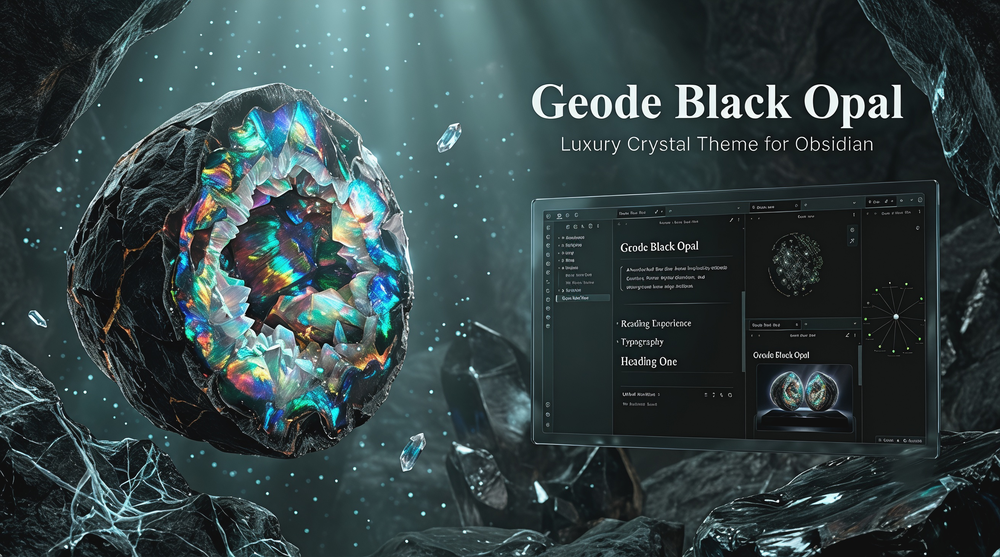
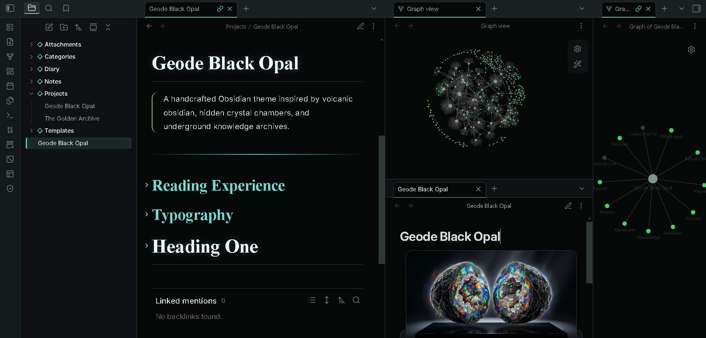
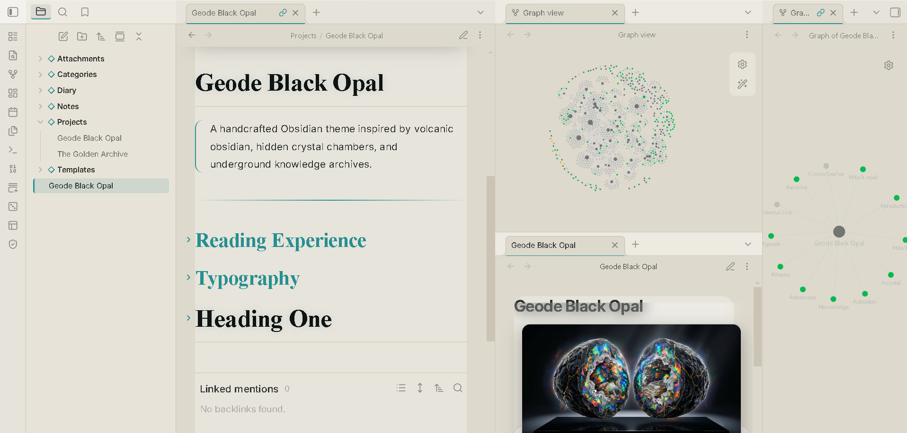
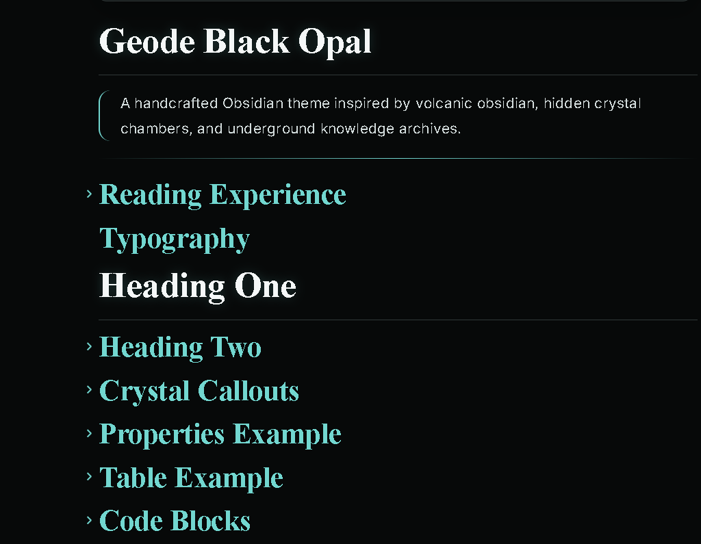
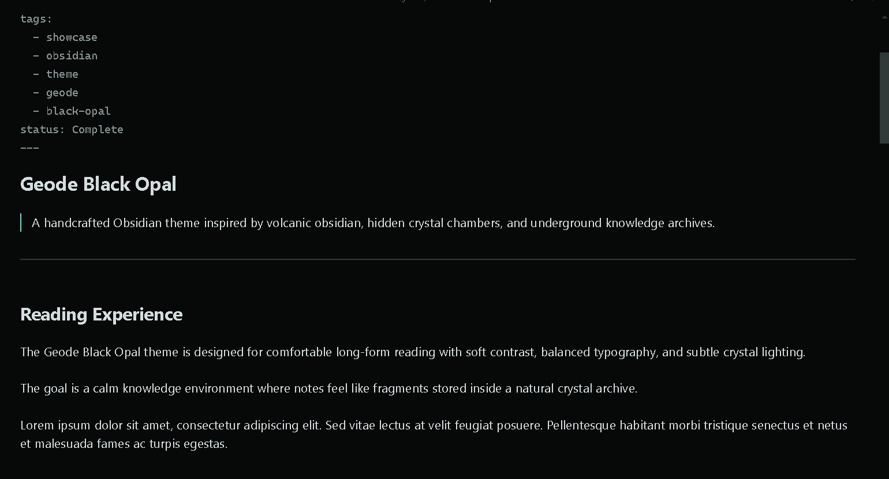
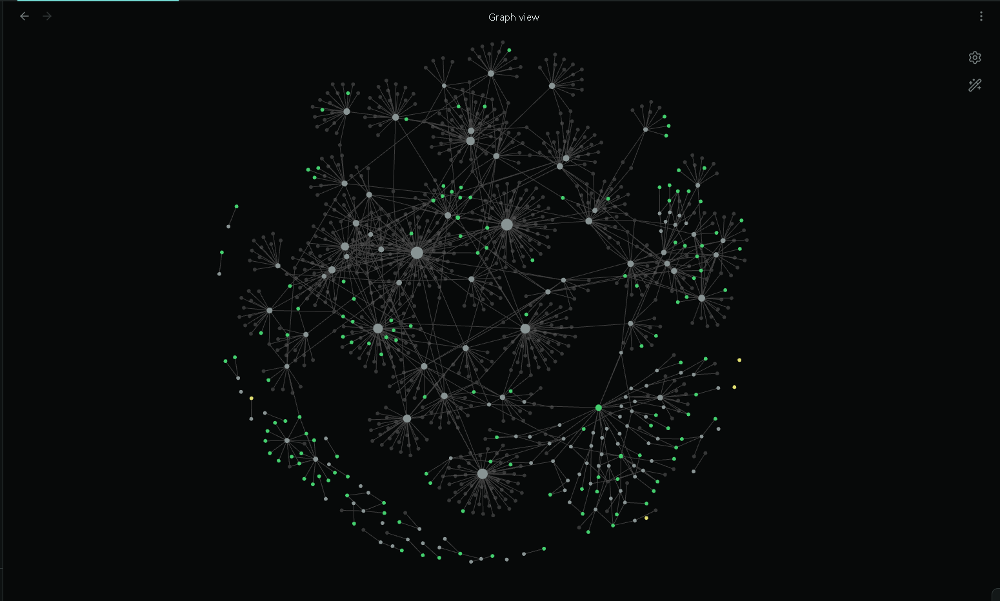
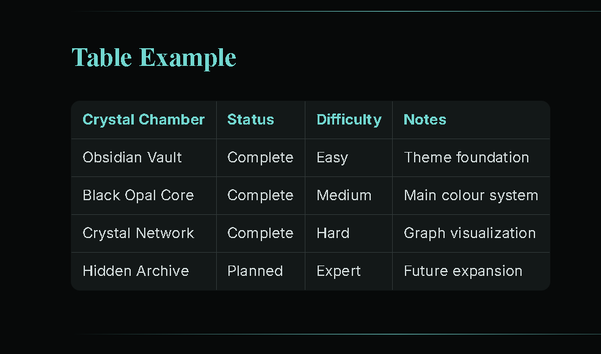
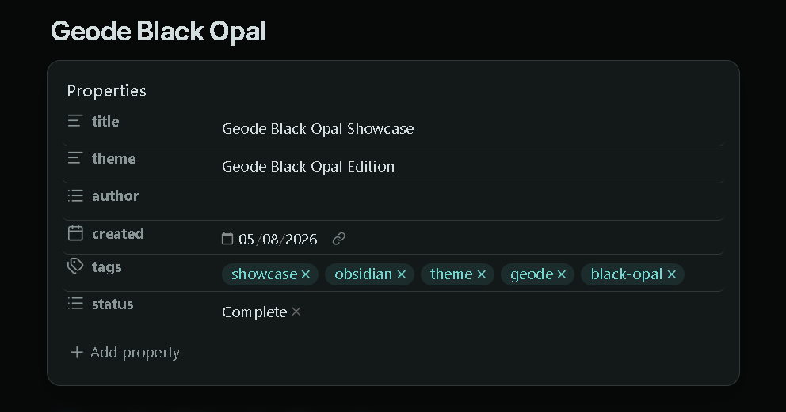
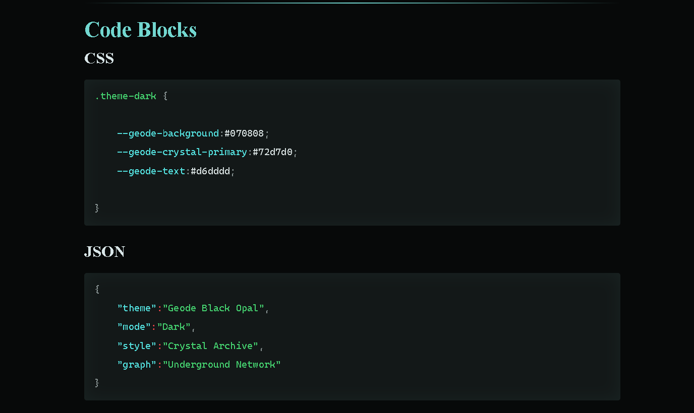
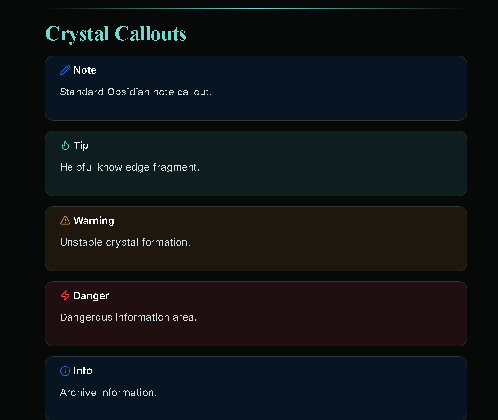

```md
# Geode Black Opal


A handcrafted Obsidian theme inspired by **black opal crystals, underground caves, and knowledge archives**.

Designed for:

- Comfortable long-form reading
- Focused writing sessions
- Research workflows
- Knowledge management
- Low-glare daily use

---

# Preview



---

# Support ☕

If you enjoy this theme and want to support future development:

<a href="https://www.buymeacoffee.com/CosmicSeaFox" target="_blank">

</a>

[](https://ko-fi.com/cosmicseafox)
---

# Screenshots

## Dark Mode



Deep obsidian background with black opal crystal atmosphere.

---

## Light Mode



Soft mineral surface with transparent crystal panels.

---

## Reading Experience



Optimized typography and spacing for comfortable long sessions.

---

## Source Mode



Clean writing environment with reduced distractions.

---

## Graph View



Crystal network visualization inspired by underground formations.

---

## Tables



Readable archive-style tables with balanced contrast.

---

## Properties Panel



Metadata displayed as crystal information panels.

---

## Code Blocks



Soft readable code presentation without harsh contrast.

---

## Callouts



Custom crystal knowledge chambers.

---

# Features

| Feature | Description |
|---|---|
| 🌑 Dark Mode | Black opal cave atmosphere |
| ☀️ Light Mode | Soft mineral glass interface |
| 📖 Reading Mode | Comfortable long-form reading |
| ✍️ Source Mode | Clean writing experience |
| 💎 Crystal System | Custom opal color variations |
| 📝 Callouts | Crystal archive styles |
| 📊 Tables | Balanced readable design |
| 💻 Code Blocks | Soft low-glare code panels |
| 🗂 Properties | Metadata crystal cards |
| 🕸 Graph View | Crystal network visualization |
| 🏷 Tags | Opal badge styling |
| ☑ Tasks | Custom crystal checkboxes |
| 📅 Calendar | Timeline crystal design |
| 📱 Mobile | Responsive support |

---

# Crystal Variants

Geode Black Opal includes multiple crystal personalities:

| Crystal | Style |
|---|---|
| Black Opal | Cyan crystal glow |
| Quartz | White crystal |
| Sapphire | Blue crystal |
| Emerald | Green crystal |
| Amethyst | Purple crystal |
| Citrine | Golden crystal |
| Diamond | Ice crystal |

---

# Installation

1. Download this repository.

2. Copy:

```
Geode-Black-Opal
```

into:

```
YourVault/.obsidian/themes/
```

3. Open Obsidian:

```
Settings → Appearance → Themes
```

4. Select:

```
Geode Black Opal
```

---

# Folder Structure

```
Geode-Black-Opal/

├── theme.css
├── manifest.json
├── README.md
├── LICENSE
├── screenshot.png
│
└── screenshots/
    ├── dark.png
    ├── light.png
    ├── reading.png
    ├── source.png
    ├── graph.png
    ├── table.png
    ├── properties.png
    ├── code.png
    └── callouts.png
```

---

# Typography

| Purpose | Font |
|---|---|
| Body | Inter |
| Headings | Cormorant Garamond |
| Code | JetBrains Mono |

---

# Compatibility

| Feature | Status |
|---|---|
| Obsidian Desktop | ✅ |
| Obsidian Mobile | ✅ |
| Reading Mode | ✅ |
| Source Mode | ✅ |
| Live Preview | ✅ |
| Graph View | ✅ |
| Properties | ✅ |
| Tables | ✅ |
| Callouts | ✅ |
| Code Blocks | ✅ |
| Dataview | ✅ |
| Tasks | ✅ |

---

# Design Philosophy

Geode Black Opal focuses on:

- Reduced eye strain
- Calm visual atmosphere
- Clear typography
- Balanced contrast
- Minimal distractions
- Long-term comfort

Created for:

- Writers
- Researchers
- Students
- Developers
- Knowledge keepers

---

# Dark Mode

Features:

- Deep obsidian surfaces
- Black crystal backgrounds
- Cyan opal highlights
- Ambient cave lighting
- Low-glare reading environment

---

# Light Mode

Features:

- Soft mineral surfaces
- Transparent crystal panels
- Dark readable text
- Gentle contrast
- Comfortable daytime reading

---

# Credits

Fonts:

- Inter
- Cormorant Garamond
- JetBrains Mono

Made for the Obsidian community.

---

# License

MIT License

Made with ❤️ for writers, researchers, and knowledge explorers.

---

# Support ☕

If you enjoy this theme and want to support future development:

<a href="https://www.buymeacoffee.com/CosmicSeaFox" target="_blank">

</a>

[](https://ko-fi.com/cosmicseafox)
---